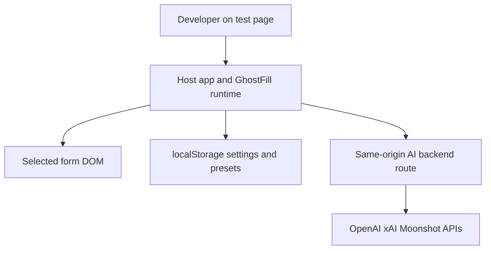

## Executive summary
GhostFill is a browser-delivered developer tool with a small runtime surface: it detects form fields, fills them locally, and can optionally call a same-origin AI backend. The highest-risk areas are no longer client-side secret handling in the package itself; they are now operational misuse of the optional `/api/ghostfill` backend, same-origin access to locally stored presets, and prompt-shaping attacks from hostile page markup. The current code materially reduces exposure by removing browser-side provider keys and only sending non-secret field metadata to AI transports.

## Scope and assumptions
- In scope: `src/index.ts`, `src/overlay.ts`, `src/ai.ts`, `src/detector.ts`, `src/types.ts`, `src/server.ts`, `README.md`, `package.json`, `tsup.config.ts`.
- Out of scope: consumer-owned backend implementations beyond the documented example route, provider infrastructure, deployment config, and the generated `dist/` artifacts.
- Assumption: GhostFill is used as a developer tool on same-origin test pages, not as a public production feature.
- Assumption: any secure AI route is implemented server-side and keeps provider secrets out of the browser, as described in `README.md:63-132`.
- Assumption: preset prompts are treated as non-secret user convenience data because they are stored in localStorage (`src/overlay.ts:53-80`, `src/overlay.ts:1328-1338`).
- Open questions that would materially change ranking:
  - Will `/api/ghostfill` be reachable outside authenticated local or internal environments?
  - Do you need multi-tenant isolation or per-user quota controls on the backend route?
  - Should preset prompts ever contain customer or regulated data?

## System model
### Primary components
- Browser runtime: `init()` mounts the overlay and `fill()` performs programmatic fills (`src/index.ts:30-72`).
- DOM detector/filler: field detection and native event-based filling live in `src/detector.ts` and `src/filler.ts`.
- Optional AI transport: `generateFillData()` serializes only field metadata and sends it to a backend route or callback (`src/ai.ts:54-172`, `src/types.ts:36-69`).
- Local persistence: UI settings and presets are stored in localStorage (`src/overlay.ts:53-95`, `src/overlay.ts:703-744`, `src/overlay.ts:1328-1338`).
- Optional server example: `README.md:73-132` documents a Next.js route that fans out to OpenAI, xAI, or Moonshot using server-side env vars.

### Data flows and trust boundaries
- Host page DOM -> GhostFill detector.
  - Data: field labels, types, select options, constraints.
  - Channel: browser DOM APIs.
  - Security guarantees: none beyond same-origin page execution; hidden, disabled, and read-only fields are skipped (`src/detector.ts:97-103`).
  - Validation/normalization: labels are normalized from DOM attributes and nearby text; only metadata is later serialized for AI (`src/detector.ts:13-174`, `src/ai.ts:54-65`).
- GhostFill runtime -> localStorage.
  - Data: theme, provider choice, `useAI`, presets, active preset, toolbar positions.
  - Channel: `localStorage`.
  - Security guarantees: same-origin only, but any same-origin script can read/write it.
  - Validation/normalization: settings and presets are sanitized on load (`src/overlay.ts:24-80`).
- GhostFill runtime -> same-origin AI backend.
  - Data: provider id, prompt text, non-secret field metadata.
  - Channel: `fetch()` POST JSON to `ai.endpoint` or `/api/ghostfill`.
  - Security guarantees: relies on the host app's auth, cookies, TLS, CSRF, and rate limiting; none are enforced by the library itself (`src/ai.ts:139-172`).
  - Validation/normalization: response items are type-checked before fill execution (`src/ai.ts:30-52`, `src/ai.ts:95-122`).
- AI backend -> provider APIs.
  - Data: provider API keys, prompt/messages, model selection.
  - Channel: HTTPS provider SDK/API calls.
  - Security guarantees: intended to be server-side only per the documented example (`README.md:85-128`).
  - Validation/normalization: example route validates provider enum and field-array presence but leaves auth/rate limiting to the integrator (`README.md:105-128`, `README.md:132`).

#### Diagram

## Assets and security objectives
| Asset | Why it matters | Security objective (C/I/A) |
| --- | --- | --- |
| Provider API keys | Key theft enables quota abuse and provider account compromise | C |
| Provider quota / spend | Unauthenticated or abusive route traffic can create direct cost and service disruption | A |
| Form fill integrity | Wrong or hostile fills can corrupt test flows and mask application bugs | I |
| Prompt presets in localStorage | Users may store sensitive business context there by mistake | C |
| Package artifacts and docs | Consumers copy usage patterns directly from the repo | I |

## Attacker model
### Capabilities
- Can control or influence form labels/options/content on the target page.
- Can make unauthenticated requests to a copied backend route if the integrator exposes it.
- Can read localStorage if they gain same-origin script execution in the host app.
- Can return malformed data from a compromised or buggy backend/provider integration.

### Non-capabilities
- Cannot steal provider keys from GhostFill's shipped browser code after this refactor because the package no longer stores or transmits them directly (`src/overlay.ts:494-497`, `src/ai.ts:153-160`).
- Cannot access hidden, disabled, or read-only fields through standard detection (`src/detector.ts:97-103`).
- Does not get backend auth, rate limiting, or provider-side protections unless the consumer implements them.

## Entry points and attack surfaces
| Surface | How reached | Trust boundary | Notes | Evidence (repo path / symbol) |
| --- | --- | --- | --- | --- |
| `init(options)` | Imported by host app | Developer config -> browser runtime | Controls AI transport and shortcut registration | `src/index.ts:30-43` |
| `fill(params)` | Imported by host app | Developer config -> browser runtime | Programmatic path can use local or backend AI mode | `src/index.ts:49-72` |
| DOM field detection | User clicks/selects a container | Host page -> GhostFill runtime | Labels/options come from page-controlled markup | `src/detector.ts:89-197` |
| localStorage settings/presets | Automatic UI persistence | Browser runtime -> storage | Same-origin readable; no secret storage intended | `src/overlay.ts:53-95`, `src/overlay.ts:1328-1338` |
| AI backend fetch | `useAI` + configured `ai` | Browser runtime -> backend route | Defaults to `/api/ghostfill` when AI is enabled | `src/ai.ts:139-172` |
| Example backend route | Consumer copies README snippet | Backend -> provider APIs | Server-side env vars for OpenAI/xAI/Moonshot | `README.md:73-132` |

## Top abuse paths
1. Attacker finds a publicly reachable `/api/ghostfill` route, sends repeated large POST bodies, and burns provider quota or saturates the backend.
2. Integrator ignores the secure transport design, passes secrets through custom browser code, and exposes provider credentials to page JavaScript or bundled source.
3. Same-origin XSS in the host app reads GhostFill presets from localStorage and exfiltrates any sensitive prompt text a user stored there.
4. Hostile form labels/options on the page manipulate the AI prompt so GhostFill generates misleading or disruptive sample data.
5. A buggy or compromised backend/provider returns malformed JSON, causing repeated fill failures or user confusion during testing.

## Threat model table
| Threat ID | Threat source | Prerequisites | Threat action | Impact | Impacted assets | Existing controls (evidence) | Gaps | Recommended mitigations | Detection ideas | Likelihood | Impact severity | Priority |
| --- | --- | --- | --- | --- | --- | --- | --- | --- | --- | --- | --- | --- |
| TM-001 | Internet or internal attacker | Consumer exposes `/api/ghostfill` without auth, quotas, or body limits | Abuse the backend route to generate provider traffic at scale | Direct cost, quota exhaustion, degraded availability | Provider quota / spend | Browser runtime only sends metadata and assumes a backend route (`src/ai.ts:153-160`); README explicitly keeps secrets server-side (`README.md:65-132`) | No auth, rate limiting, or request-size limits are enforced by the package | Gate the backend route behind app auth, add per-user/IP rate limits, cap field count and body size, and keep it dev-only where possible | Log route calls by user/session/provider and alert on burst traffic or abnormal 4xx/5xx | Medium | High | high |
| TM-002 | Misconfigured consumer integration | Integrator bypasses the secure backend design and puts provider secrets in browser code or a client-side callback | Reintroduce client-side secret exposure | Provider key compromise and downstream provider abuse | Provider API keys | Legacy `apiKey` is ignored and warned on (`src/overlay.ts:494-497`); browser settings no longer collect keys (`src/overlay.ts:703-727`) | Deprecated `apiKey` remains in the public type for compatibility, and custom callbacks can still be misused by consumers | Remove deprecated `apiKey` in the next major release, keep docs/examples backend-only, and audit custom callbacks for secret use | Search bundles for provider key names, watch provider auth events, and lint against secret-looking strings in client code | Low | High | medium |
| TM-003 | Same-origin script / stored XSS | Attacker can execute JavaScript in the host app origin | Read GhostFill presets or settings from localStorage | Disclosure of any sensitive text the user saved as a preset | Prompt presets in localStorage | Storage is sanitized and intentionally limited to settings/presets (`src/overlay.ts:24-80`, `src/overlay.ts:1328-1338`); README tells users to keep presets non-secret (`README.md:138-143`) | localStorage is not a secrecy boundary | Treat presets as non-secret only, add an optional memory-only mode if needed, and document that same-origin scripts can read storage | Monitor host-app XSS signals and optionally emit a console warning when saving unusually long presets | Medium | Medium | medium |
| TM-004 | Malicious page markup | Attacker controls labels/options/text in the selected form | Shape the AI prompt to coerce bad or costly outputs | Integrity loss in generated sample data; potential token-cost inflation | Form fill integrity, provider quota / spend | Only non-secret field metadata is serialized (`src/ai.ts:54-65`); hidden, disabled, and read-only fields are skipped (`src/detector.ts:97-103`) | No hard caps on label/option length or field count before sending to backend | Truncate long labels/options, cap total serialized fields/options, and reject oversized requests server-side | Track unusually large field payloads and repeated provider parse errors | Medium | Medium | medium |
| TM-005 | Buggy or compromised backend/provider | AI route returns malformed, oversized, or unexpected data | Force parse failures or repeated fill errors | Reduced availability/usability of AI-assisted fills | Form fill integrity | Response parsing validates item shape before fill (`src/ai.ts:30-52`, `src/ai.ts:95-122`) | No client timeout or response-size guard; backend example is minimal | Normalize provider responses server-side, add backend timeouts and size limits, and optionally add client abort support | Log parse failures and provider latency by provider/model | Low | Medium | low |

## Criticality calibration
- `critical` for this repo means the shipped browser package directly exposes provider secrets or enables unauthorized provider access by default.
  - Examples: embedding API keys in client code; sending current form values or tokens to the provider automatically.
- `high` means a realistic integration mistake can cause direct cost or secret compromise, even if the core package does not do it by default.
  - Examples: a public `/api/ghostfill` route with no auth/rate limits; a copied backend route that logs provider keys or full prompts.
- `medium` means integrity or confidentiality issues require host-app compromise or user/operator misuse.
  - Examples: localStorage preset disclosure after same-origin XSS; hostile label text skewing AI outputs.
- `low` means failures are mostly availability or UX degradations with limited blast radius.
  - Examples: malformed provider JSON causing fill errors; toolbar state corruption in localStorage.

## Focus paths for security review
| Path | Why it matters | Related Threat IDs |
| --- | --- | --- |
| `src/overlay.ts` | Controls settings persistence, AI enablement, and the main runtime flow | TM-002, TM-003 |
| `src/ai.ts` | Defines what metadata crosses the AI boundary and validates backend responses | TM-001, TM-004, TM-005 |
| `src/types.ts` | Exposes the public AI transport contract and deprecation surface | TM-002 |
| `src/index.ts` | Public entrypoints for UI and programmatic use | TM-001, TM-002 |
| `README.md` | Consumers will copy the backend/provider integration example directly | TM-001, TM-002 |

## Quality check
- Entry points covered: `init`, `fill`, DOM detection, localStorage, backend fetch, README route example.
- Trust boundaries covered in threats: page DOM, storage, backend route, provider APIs.
- Runtime vs CI/dev separation: this repo ships a browser library; no in-repo CI/runtime backend was modeled beyond the documented example route.
- User clarifications: none were provided, so rankings rely on the explicit assumptions above.
- Assumptions and open questions: included in `Scope and assumptions`.
